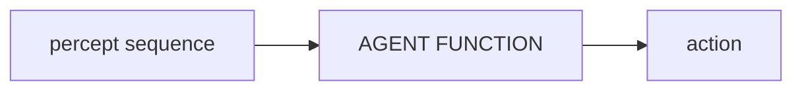
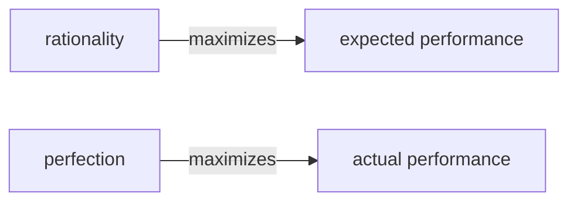

#AI_NOTES

# Agent
An Agent can be anything that can be percieving its __environment__ through sensors and acting upon that environment through __actuators.__

## Percept 
We use the term __percept__ to refer to the agent's perceptual inputs at any given instant. An agents __percept sequence__ is the complete history of everything the agent has ever percieved.

![[Pasted image 20230129101340.png]]

==___In general, an agent's choice of action at any given instant can depend on the entire percept sequence observed to date, but not on anything it hasn't percieved.___==

### Agent function 
Mathematically speaking ,we can say that the agents behaviour is described by the __agent function__ that maps any given percept sequence to an action.

### Agent Program
It is important to keep the ideas of __Agent function__ and __Agent Program__ distinct.
__Agent program__ is concrete implementation, running within one physical

# Good Behavior: The concept of Rationality:
__What is it to do the right thing?__
By considering the ___consequences___ of the agents behaviour. 
	- When an agent is plunked down in an environment, it generates a sequence of actions acccording to the percepts that it recieves. 
	- Thus sequence of actions causes the environment to go through [[sequence of states (environment states)]]. If the sequence is desirable then the agent has performed well. 
	- The desirability is captured by ==__performance measure__== that evaluates the sequence of environment states. 

Notice that we said [[sequence of states (environment states)]] not __agent states__:
	If we define success in terms of agent's opinion of its own performance, an agent could achieve perferct rationality simply by deluding itself that its performance was perfect. 
		EX: Human agents are notorious for "sour grapes" -believing they did not really want something (e.g. Nobel Prize) after not getting it. 🤣🤣🤣
___A general rule is to define a "performance measure" according to what one actually wants in the environment, rather than to think what one wants the agent to behave like.

# Rationality:
The rational at any given time depends on four things: 
- performance measure --> defining the criterion for success
- agent's prior knowledge of the environment.
- actions that the agent can perform.
- agents percept sequence to date.

This leads to the definintion of Rational Agent:
___For each possible percept sequence, a rational agent should select an action that is expected to maximize its performance measure, given the evidence provided in the percept sequence and whatever built-in knowledge the agent has. 

## Omniscience:
We need to distinguish between rationality and Omniscinece. ==___An Omniscinece agent knows the actual outcome of its actions and can act accordingly___==; but omniscience is impossible in reality. 
Rationality is not the same as perfection, rationality maximizes the __expected performance__ where as perfection maximizes __actal performance__

___Our definition of rationality does not require Omniscience.___

## Information Gathering: 
- Doing actions inorder to modify future percepts - sometimes called information gathering., is important part of rationality. __Exploration is also a part of this idea__
- It is equally important that the agent learns from the information that is gathered. 
- As the agent gains experience, the prior knowledge of the environment can be modified and augumented. 

## Autonomy:
- There are cases where the agent is unable to learn and only relies on the prior knowledge of its designer rather than its own percepts, we say that the agent lacks __autonomy__. 
- A rational agent should be autonomous - it should learn what ir can compensate for partial or incorrect prior knowledge.

- - -
- - - 
