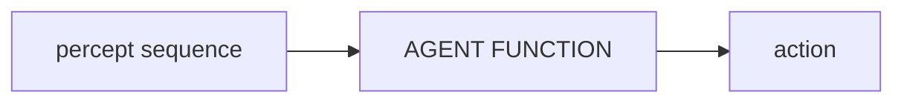
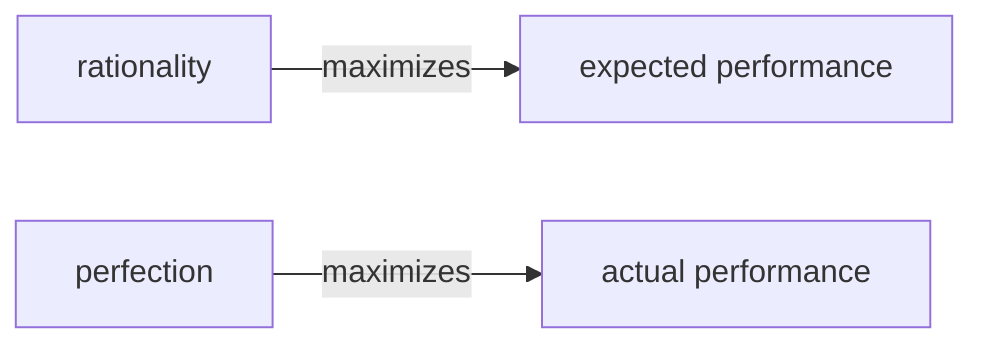
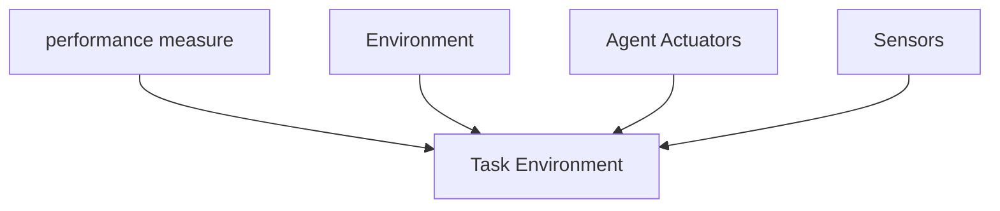

#AI_NOTES 
# Rational Agent : 

An __agent__ is something that acts, all computer programs do something. Computer Agents are expected to do more: 
- operate __autonomously__
- __percieve__ their environment
- __percisit__ over a prolonged time period
- __adapt__ to change
- __create and achieve goal.__

A __rational agent__ acts as to achieve the best outcome, or when there is uncertainity, the best expected outcome. 

The observation that some agents behave better than others leads naturally to the idea of a ==__rational agent__ - one that behaves as well as possible.== How well an agent can behave depends on the nature of the environment; some environments are more difficult than others.

# [[Agent]]
An Agent can be anything that can be percieving its __environment__ through sensors and acting upon that environment through __actuators.__

## Percept 
We use the term __percept__ to refer to the agent's perceptual inputs at any given instant. An agents __percept sequence__ is the complete history of everything the agent has ever percieved.

![[Pasted image 20230129101340.png]]

==___In general, an agent's choice of action at any given instant can depend on the entire percept sequence observed to date, but not on anything it hasn't percieved.___==

# Question, how is the first step in a decision tree considered as the first step to be with a percept when it should not have percieved anything ?

### Agent function 
Mathematically speaking, we can say that the agents behaviour is described by the __agent function__ that maps any given percept sequence to an action.

### Agent Program
It is important to keep the ideas of __Agent function__ and __Agent Program__ distinct.
__Agent program__ is concrete implementation, running within one physical

# Good Behavior: The concept of Rationality:
__What is it to do the right thing?__
By considering the ___consequences___ of the agents behaviour. 
	- When an agent is plunked down in an environment, it generates a sequence of actions acccording to the percepts that it recieves. 
	- Thus sequence of actions causes the environment to go through [[sequence of states (environment states)]]. If the sequence is desirable then the agent has performed well. 
	- The desirability is captured by ==__performance measure__== that evaluates the sequence of environment states. 

Notice that we said [[sequence of states (environment states)]] not __agent states__:
	If we define success in terms of agent's opinion of its own performance, an agent could achieve perferct rationality simply by deluding itself that its performance was perfect. 
		EX: Human agents are notorious for "sour grapes" -believing they did not really want something (e.g. Nobel Prize) after not getting it. 🤣🤣🤣
___A general rule is to define a "performance measure" according to what one actually wants in the environment, rather than to think what one wants the agent to behave like.

# Rationality:
The rational at any given time depends on four things: 
- performance measure --> defining the criterion for success
- agent's prior knowledge of the environment.
- actions that the agent can perform.
- agents percept sequence to date.

This leads to the definintion of Rational Agent:
___For each possible percept sequence, a rational agent should select an action that is expected to maximize its performance measure, given the evidence provided in the percept sequence and whatever built-in knowledge the agent has. 

## Omniscience:
We need to distinguish between rationality and Omniscinece. ==___An Omniscinece agent knows the actual outcome of its actions and can act accordingly___==; but omniscience is impossible in reality. 
Rationality is not the same as perfection, rationality maximizes the __expected performance__ where as perfection maximizes __actal performance__

___Our definition of rationality does not require Omniscience.___

## Information Gathering: 
- Doing actions inorder to modify future percepts - sometimes called information gathering., is important part of rationality. __Exploration is also a part of this idea__
- It is equally important that the agent learns from the information that is gathered. 
- As the agent gains experience, the prior knowledge of the environment can be modified and augumented. 

## Autonomy:
- There are cases where the agent is unable to learn and only relies on the prior knowledge of its designer rather than its own percepts, we say that the agent lacks __autonomy__. 
- A rational agent should be autonomous - it should learn what ir can compensate for partial or incorrect prior knowledge.

- - -
- - - 

# Nature of Environments

## Task Environment:
__[[Task environments]] are the problems to which rational agents are the solutions__
The flavour of the task environments, directly affects the appropriate design for the agent program. 

Under the rationality we were required to present __performance measure__, __the environment__, __agents actuators__  grouping these falls under the heading __task environment__.

- ==We call this as __PEAS__ (__Performance, Environment, Actuators, Sensors__)==
- ==In designing an agent, the first step must always be specifying the __task environment__ as fully as possible. ==

### PEAS description of the [[Task environment]] for an automated taxi

| AGENT TYPE  | PERFORMANCE MEASURE | ENVIRONMENT | ACTUATORS | SENSORS       |
| ----------- | ------------------- | ----------- | --------- | ------------- |
| Taxi Driver | Safe                | roads       | steering  | cameras       |
|             | Fast                | traffic     | acc       | sonar         |
|             | legal               | pedestrians | brake     | speedometer   |
|             | comfortable         | customers   | signal    | GPS           |
|             | max profits         |             | horn      | odometer      |
|             |                     |             | display   | accelerometer |
|             |                     |             |           | engine        |
|             |                     |             |           | sensors       |
|             |                     |             |           | keyboard      | 

There are cases where we create an artificial environment defined by the keyboard input and charecter output on screen. Here we can say "this is not a real environment, is it?" In fact, what matters is, not the distinction between "real" and "artificial" environments but the  complexity of the relationship among the __(behaviour of the agent - percept sequence generated by the environment - performance measure.)__  
- - -
 
## [[Properties of Task environments]]
The range of task environments is fairly large. We can, however, identify a fairly small number of dimensions along which task environments can be categorized. These dimensions determine, to a large extent, the appropriate __agent design__ and the applicability of each of the principal families of techniques for __agent Implementation__.  

### Dimensions of Task environments.
#### __Fully observable v/s partially observable__ : 
- A task environment is effecetively __fully observable__ if the sensors detect all aspects that are _relevant_ to the choice of action; relavance, in turn, depends on the performance measure. 
- An environment might be __partially observable__ because of noisy and inaccurate sensors or because parts of the state are simply missing from the sensor data.
- __unobservable__ means that there are no sensors for the agents 
- - -

#### __Single Agent v/s multi agent__
- __competitive__ : where one agent tries to increase its performance measure and this reduces the other agents performance. 
- __Partially competitive / Partially cooperative__ : avoids collision (partially cooperative) + cases such as this also includes a competitive communication to avoid collision or gain a better performance measure (ex : taxi driver's).
- __Cooperative__ : where the agents avoid collisions with regard to performance measures. 
- - -

#### __Deterministic v/s stochastic__ : 
__Determinisitc__: If the next state of the environment is completely determined by the current state and the action executed by the agent then we say the environment is determinisitc. 
	___"An agent need not worry about uncertainity in a fully observable, determinisitc environment"___
In definition we ignore uncertainity that arises purely from the actions of other agents in multiagent environments; thus a game can be deterministic even though each agent may not be able to predict the actions of others.

__Stochastic__: If the environment is partially observable then it is called stochastic.
Our use of stochastic generally implies that uncertainity about outcomes is quantified in terms of probabilities. 

__Non Deterministic__ environment is one which actions are charecterized by ___possible___ outcomes, but no probabilities are attached to them. These are usually __associated with performance measures that require__ the ==__agent__ to succeed== for ___all possible___ outcomes of its actions. 
- - - 

#### __Episodic v/s sequential__:
__Episodic environment__, the agent's experience is divided into atomic episodes. In each episode the agent recieved a percept and then performs a single action.

___"Crucially, the next episode does not depend on the action taken in the previous episodes."___
==__Many classification tasks are episodic__==

__Sequential environments:__ The current decisions could affect all future decisions.
ex: chess, taxi, both cases, short term actions can have long term consequences. 
Episodic is simpler than sequential environments because the agents does not have to think ahead.
- - -

#### __Static v/s Dynamic__
__Dynamic__ : IF the environment can change during the agent is deliberating, then we say environment is dynamic.
__Static__ : static environment are easier to deal with because the agent does not have to keep looking at the world while making a decision on an action.

___Dynamic environments keep asking the agents for their action, and when there is no action it is considered as deciding to do nothing.___
==___If the environment itself does not change and the agents performance score changes, then we say that the environment is semidynamic.___==
chess while the game is timed is semidynamic where as taxi driving is dynamic, crossword is static.
- - -

#### __Discrete v/s Continuous__
==__The discrete/continuous distinctions applies to the state of the environment, to the way time is handled and to the percepts and actions of the agents.__==
For chess has a finite number of distinct states and without the clock running has distinct actions and percepts.
Taxi driving is continuous, where state is continuosly evolving and the percepts such as steer is also a continous input. 
- - -

#### __Known v/s Unknown__
The distinction in this case is __not__ to the environment but for the [[agent]]'s state of knowledge about the "laws of physics" of the environment. 

__known environment__ : In a known environment, the outcome (_outcome probabilities if the environment is stochastic_)for actions are given.

__If the environement is unknown the [[agent]] will have to learn how it works to make good decisions.__==Note that the distinction between known and unknown environments is not same as fully and partially observable environments. It is quite possible for a known environment to be partially observable. ==

Ex: solitair card games, I know the rules still unable to see the cards that have not yet been turned over.
Conversely, an _unknown environment_ can be _fully observable_, in a new video gam, the screen may show the entire game state but still dont know what buttons until I try them.

- - - 

