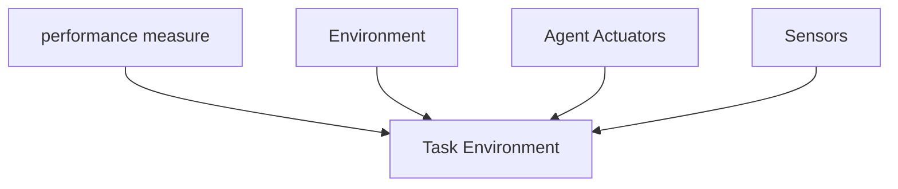

#AI_NOTES 
## Task Environment:
__Task environments are the problems to which rational agents are the solutions__
The flavour of the task environments, directly affects the appropriate design for the agent program. 

Under the rationality we were required to present __performance measure__, __the environment__, __agents actuators__  grouping these falls under the heading __task environment__.

- ==We call this as __PEAS__ (__Performance, Environment, Actuators, Sensors__)==
- ==In designing an agent, the first step must always be specifying the __task environment__ as fully as possible. ==

### PEAS description of the Task environment for an autmated taxi

| AGENT TYPE  | PERFORMANCE MEASURE | ENVIRONMENT | ACTUATORS | SENSORS       |
| ----------- | ------------------- | ----------- | --------- | ------------- |
| Taxi Driver | Safe                | roads       | steering  | cameras       |
|             | Fast                | traffic     | acc       | sonar         |
|             | legal               | pedestrians | brake     | speedometer   |
|             | comfortable         | customers   | signal    | GPS           |
|             | max profits         |             | horn      | odometer      |
|             |                     |             | display   | accelerometer |
|             |                     |             |           | engine        |
|             |                     |             |           | sensors       |
|             |                     |             |           | keyboard      | 

There are cases where we create an artificial environment defined by the keyboard input and charecter output on screen. Here we can say "this is not a real environment, is it?" In fact, what matters is, not the distinction between "real" and "artificial" environments but the  complexity of the relationship among the __(behaviour of the agent - percept sequence generated by the environment - performance measure.)__  
